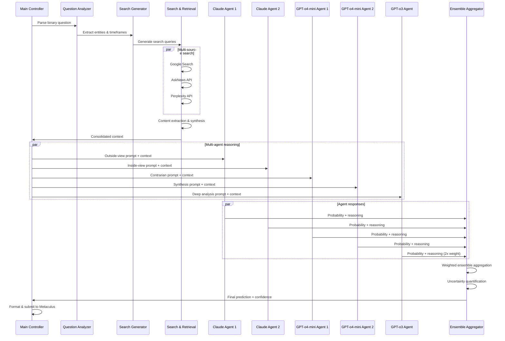
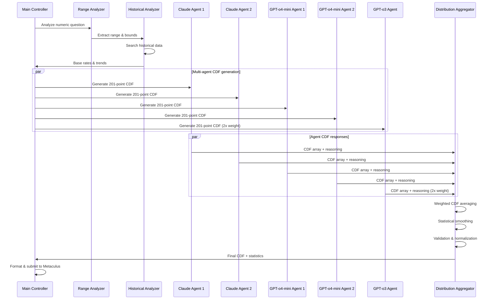
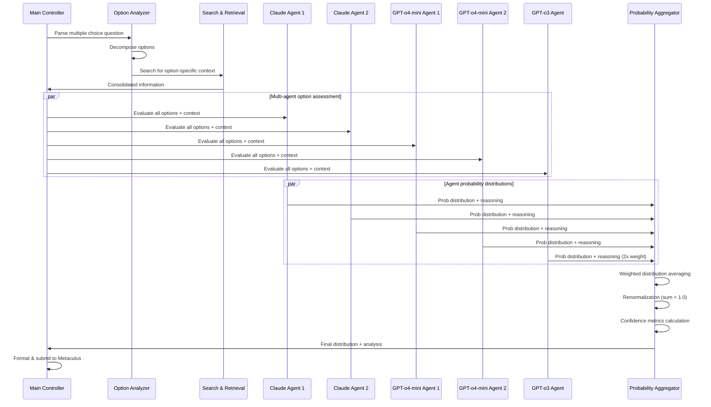

# CLAUDE.md

This file provides guidance to Claude Code (claude.ai/code) when working with code in this repository.

## Essential Commands

### Running the Bot
```bash
# Run the main forecasting bot on tournament questions
python Bot/main.py

# Run benchmark tests
python Bot/benchmark.py

# Install dependencies
pip install -r requirements.txt
```

### Environment Setup
Required environment variables in `.env`:
- `METACULUS_TOKEN` - Authentication for Metaculus API
- `OPENAI_API_KEY` - GPT models 
- `ANTHROPIC_API_KEY` - Claude models (via llm-proxy.metaculus.com)
- `SERPER_KEY` - Google search API
- `ASKNEWS_CLIENT_ID` / `ASKNEWS_SECRET` - News API
- `PERPLEXITY_API_KEY` - Research synthesis (optional)

### Key Configuration
Main configuration constants in `Bot/main.py`:
- `SUBMIT_PREDICTION = True` - Actually post to Metaculus
- `NUM_RUNS_PER_QUESTION = 5` - Ensemble size per question
- `TOURNAMENT_ID` - Target tournament (default: Q2_2025_AI_BENCHMARKING_ID)
- `USE_EXAMPLE_QUESTIONS = False` - Use test questions vs tournament

## Architecture Overview

### Multi-Agent Ensemble System
The bot implements a 5-agent forecasting committee:
- 2x Claude 3.7 Sonnet instances (robust reasoning)
- 2x GPT-o4-mini instances (complementary perspective) 
- 1x GPT-o3 instance (double-weighted for diversity)

Each agent approaches problems differently through prompt engineering directing some toward outside view (historical/reference class) reasoning and others toward inside view (mechanistic/causal) reasoning.

### Core Processing Flow
```
Question Analysis → Search Query Generation → Parallel Information Retrieval
    ↓
Content Extraction → Context Synthesis → Multi-Agent Forecast Generation
    ↓  
Ensemble Aggregation → Statistical Calibration → Final Prediction
```

### Key Components

**Search & Retrieval (`Bot/search.py`)**:
- `process_search_queries()` - Orchestrates multi-source information gathering
- Integrates Google Search, AskNews, Perplexity APIs
- `FastContentExtractor` for robust web content extraction

**Question-Type Handlers**:
- `Bot/binary.py` - Binary predictions with ensemble voting
- `Bot/numeric.py` - Numeric forecasts with 201-point CDFs  
- `Bot/multiple_choice.py` - Multi-option probability distributions

**LLM Interface (`Bot/llm_calls.py`)**:
- `call_claude()` - Claude via Metaculus proxy
- `call_gpt_o3()` / `call_gpt_o4_mini()` - OpenAI models
- Async processing with retry logic and backoff

### Forecast Generation Process
Binary questions follow this multi-stage process:
1. Generate historical vs current context searches
2. Parallel context retrieval and article summarization
3. 5-agent ensemble reasoning with weighted aggregation
4. Statistical ensemble combining forecasts (o3 gets 2x weight)

### Content Extraction
`FastContentExtractor.py` implements multi-strategy web scraping:
- BeautifulSoup with site-specific selectors
- Trafilatura structured extraction  
- Readability algorithm fallback
- Metadata and entity recognition

### Output Management
- Forecasts saved to `2025_Fall_tournament_forecasts/` with detailed reasoning
- Each question gets comprehensive log file with multi-agent outputs
- Automatic filename sanitization for cross-platform compatibility

## Development Notes

### Async Architecture  
Heavy use of `asyncio` for concurrent API calls and processing. All major functions are async and use `asyncio.gather()` for parallel execution.

### Error Handling
Robust retry logic with exponential backoff for API calls. Graceful degradation when services unavailable.

### Benchmarking System
`benchmark.py` provides comprehensive evaluation with normalized peer scoring, Monte Carlo simulation, and performance visualization against community predictions.

## Detailed Agentic Flows

### Binary Question Processing Flow

Binary questions use a sophisticated multi-agent ensemble approach with specialized reasoning strategies:

#### Phase 1: Question Analysis & Search Strategy
1. **Question Parsing**: Extract key entities, timeframes, and prediction targets
2. **Search Query Generation**: Create targeted queries for both historical context and current developments
3. **Query Categorization**: Classify searches as base-rate/historical vs. current-events focused

#### Phase 2: Parallel Information Retrieval
1. **Multi-Source Search**: Concurrent queries across Google Search, AskNews, Perplexity
2. **Content Extraction**: FastContentExtractor processes web pages with multiple fallback strategies
3. **Content Synthesis**: Aggregate and deduplicate information from all sources

#### Phase 3: Multi-Agent Ensemble Reasoning
1. **Agent Specialization**:
   - **Claude Instance 1**: Outside-view reasoning (base rates, reference class)
   - **Claude Instance 2**: Inside-view reasoning (mechanistic, causal analysis)
   - **GPT-o4-mini Instance 1**: Contrarian perspective, devil's advocate
   - **GPT-o4-mini Instance 2**: Synthesis and meta-reasoning
   - **GPT-o3 Instance**: Deep analysis with double weighting (2x influence)

2. **Reasoning Process**: Each agent independently:
   - Analyzes provided context
   - Applies their specialized reasoning approach
   - Generates probability estimate with detailed justification
   - Provides confidence intervals and uncertainty bounds

#### Phase 4: Ensemble Aggregation
1. **Vote Collection**: Gather probability estimates from all 5 agents
2. **Weighted Averaging**: Standard agents get 1x weight, GPT-o3 gets 2x weight
3. **Uncertainty Quantification**: Calculate ensemble variance and confidence bounds
4. **Final Calibration**: Apply any tournament-specific calibration adjustments



### Numeric Question Processing Flow

Numeric questions require probability distribution estimation over continuous ranges:

#### Phase 1: Range Analysis
1. **Question Decomposition**: Identify the numeric target and its natural bounds
2. **Historical Analysis**: Search for comparable historical data points
3. **Trend Identification**: Look for relevant trends and growth patterns

#### Phase 2: Distribution Modeling
1. **Base Rate Estimation**: Find historical distributions for similar quantities
2. **Trend Adjustment**: Modify base rates based on current context
3. **Uncertainty Bounds**: Establish confidence intervals around estimates

#### Phase 3: Multi-Agent CDF Generation
1. **Agent Specialization**:
   - Agents generate 201-point cumulative distribution functions
   - Different agents focus on different aspects (trend vs. base rate)
   - Each provides reasoning for their distribution shape

#### Phase 4: Distribution Ensemble
1. **CDF Aggregation**: Average the 201-point CDFs with agent weights
2. **Smoothing**: Apply statistical smoothing to ensure valid probability distribution
3. **Validation**: Ensure CDF properties (monotonic, bounds [0,1])



### Multiple Choice Question Processing Flow

Multiple choice questions require probability distribution across discrete options:

#### Phase 1: Option Analysis
1. **Option Decomposition**: Analyze each choice independently
2. **Mutual Exclusivity Check**: Ensure options are properly exclusive
3. **Context Gathering**: Search for information relevant to each option

#### Phase 2: Per-Option Reasoning
1. **Individual Assessment**: Each agent evaluates every option independently
2. **Comparative Analysis**: Agents perform head-to-head comparisons
3. **Elimination Strategy**: Rule out clearly impossible options

#### Phase 3: Probability Allocation
1. **Agent Voting**: Each agent provides probability distribution across all options
2. **Normalization**: Ensure probabilities sum to 1.0 for each agent
3. **Ensemble Combination**: Weighted average of agent distributions

#### Phase 4: Final Distribution
1. **Weighted Aggregation**: Combine agent distributions with weights
2. **Renormalization**: Ensure final distribution sums to 1.0
3. **Confidence Assessment**: Calculate entropy and concentration metrics



## Agent Reasoning Specializations

### Outside View Agents (Claude Instance 1, GPT-o4-mini Instance 1)
- **Focus**: Historical base rates and reference class reasoning
- **Methodology**: Statistical analysis of similar past events
- **Bias Mitigation**: Avoid over-weighting unique aspects of current situation
- **Prompt Engineering**: Emphasize "How often do events like this actually occur?"

### Inside View Agents (Claude Instance 2, GPT-o4-mini Instance 2)  
- **Focus**: Mechanistic and causal analysis of specific situation
- **Methodology**: Detailed modeling of causal chains and mechanisms
- **Strengths**: Capture unique aspects and novel circumstances
- **Prompt Engineering**: Emphasize "What are the specific causal factors at play?"

### Meta-Reasoning Agent (GPT-o3 - Double Weight)
- **Focus**: Synthesis of outside/inside views and meta-level reasoning
- **Methodology**: Balances statistical and mechanistic approaches
- **Special Role**: Gets 2x weight in final ensemble due to superior reasoning capability
- **Prompt Engineering**: Emphasize "How should we integrate different perspectives?"

### Contrarian Agent (Rotating Assignment)
- **Focus**: Challenge consensus and explore alternative scenarios  
- **Methodology**: Actively seek disconfirming evidence and alternative explanations
- **Bias Mitigation**: Counter groupthink and overconfidence
- **Prompt Engineering**: Emphasize "What could we be missing or getting wrong?"